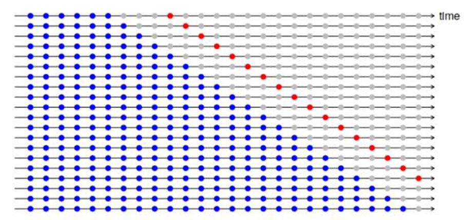
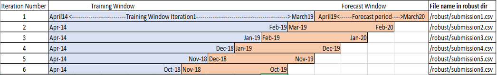

#### Project Title

# Talaria Forecasting - Financial Forecast Sandesh Brand 4 - Discovery (Jul 2020)


### Problem Statement
Generate time-series forecasts with the highest accuracy predictions possible for only the 10 financial/volume variables.
The model should be tailored to a 12-month forecast horizon but must be extendable beyond this time period.
Targets must be Robust so as to be stable over a 12 month window.

## Project structure
├── data\
│   └── Mobile Sandesh Brand 4 Data for Challenge (1).xlsx\
├── main.ipynb\
├── images\
├── robust\
├── Report_Talaria.pdf\
├── submissions\
├── requirements.txt\
└── License

### Prerequisites

```bash
pip install -r requirements.txt
```

### Robustness Methodology

- If the figure below is viewed, each horizontal line represents one iteration. Blue points are training window and (grey+red) points are forecasting/ prediction window(h = prediction window =4). In this diagram, each iteration has 4 forecasts. 
- Once all the iterations are done, RMSE is calculated for all h=1,h=2,h=3 and h=4. (h=1 means calculate the RMSE for all the iterations, for the first forecasted point, for h=2 calculate the RMSE for all the iterations for the second forecasted point….. same is repeated till h=4). Later these RMSE to be plotted in a graph. For more details https://otexts.com/fpp2/accuracy.html can be visited.






### Summary
- AutoRegressive Models
- Robustness
- Time-Series
- Linear Regression
- MAPE (Mean Absolute Percentage Error)
- AutoCorrelation
- Stationary Models
